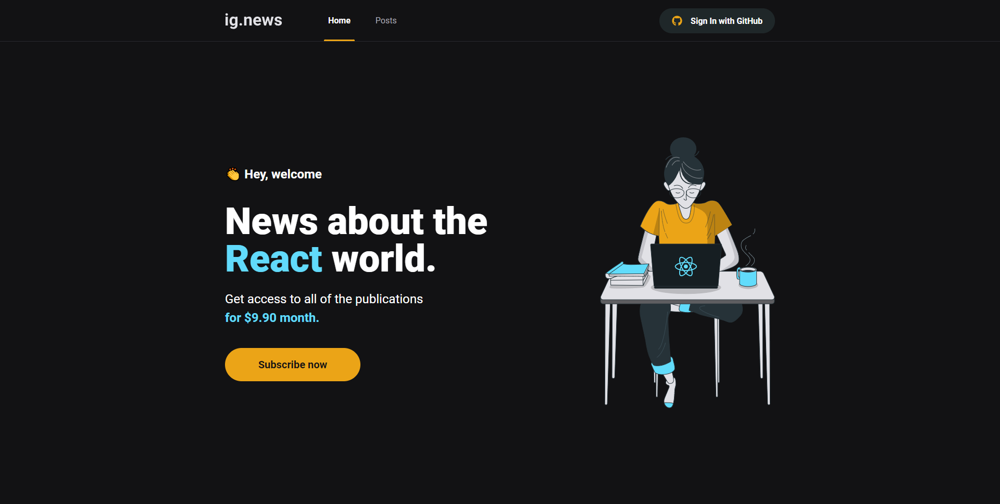
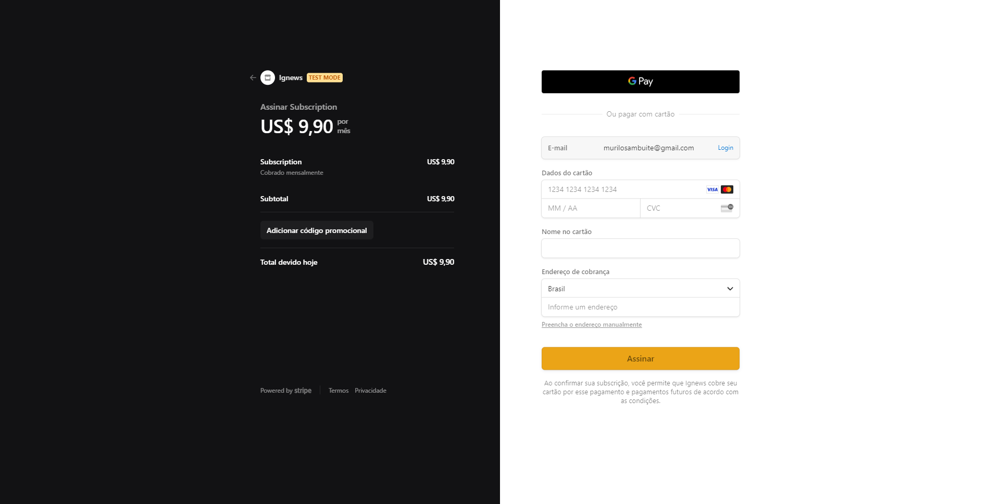
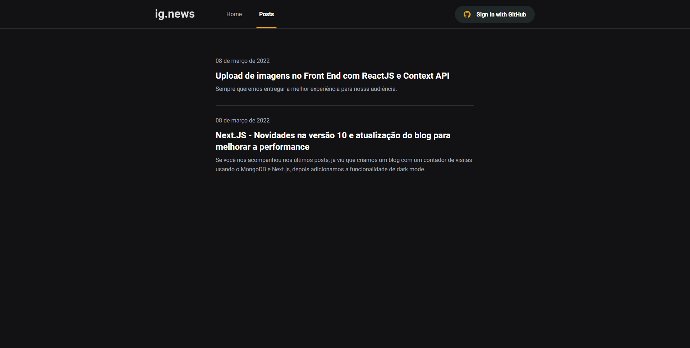
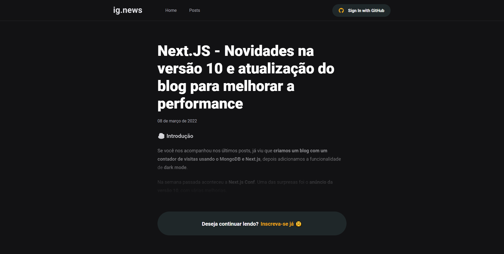

<h1 align="center" id="top">Ig.News | NextJs Blog</h1>

<p align="left">
  <a href="https://www.linkedin.com/in/murilosambuite/"> 
    
  </a>
</p>

<br />

> App developed at [Rocketseat Ignite](https://www.rocketseat.com.br/ignite).

<br />

## :camera: Demo

<p align="center">
  
</p>

<p align="center">
  
</p>

<p align="center">
  
</p>

<p align="center">
  
</p>

<br />

## :hammer: Tools/Technologies

<em>This front-end features the latest tools and practices in web development!</em>

- **React** — A library to build user interfaces
- **NextJS** — A React Framework (SSR and SSG)
- **next-auth** — Authentication for Next.js
- **Typescript** — A Javascript superset
- **SASS** — CSS extension languague
- **Stripe** — Payments infrastructure
- **FaunaDB** — Database / Data API for modern applications
- **Prismic CMS** — A Headless CMS

<br />

## :computer: Installation

### Step by step to run the application on your machine:

Clone this repository:

```
  git clone https://github.com/sambuite/ignews.git

  cd ignews
```

Run the following scripts
(You will need npm or yarn and Stripe CLI installed) :

```
  // Install the dependencies
  npm install

  // Listen to webhooks events
  stripe listen --forward-to localhost:3000/api/webhooks

  // Start the application
  npm dev
```

or if you use yarn

```
  // Install the dependencies
  yarn

  // Listen to webhooks events
  stripe listen --forward-to localhost:3000/api/webhooks

  // Start the application
  yarn dev
```

---

Developed by <a href="https://github.com/sambuite" target="_blank">Murilo Sambuite</a>

<br />

<a href="#top">De Volta ao Topo</a>
